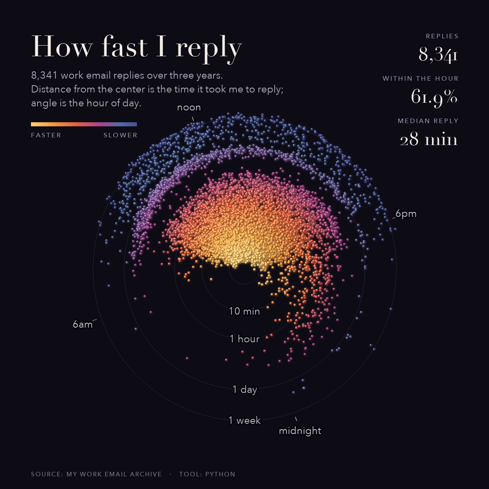

# Reply Clock

A radial data-art visualization of how fast one person answers email.



Every one of 8,341 work email replies, sent over three years, is a single bead.

- **Distance from the center = time to reply** (log scale): the center is instant; concentric
  rings mark 1 min / 10 min / 1 hour / 1 day / 1 week. The dense gold core is everything
  answered within minutes; the faint outer scatter is the rare reply that waited days.
- **Angle = hour of day.** The dial is rotated so the average reply hour points up, which
  centers the cloud. The empty wedge pointing down is the overnight gap.
- **Color also encodes speed** (gold → coral → magenta → blue), reinforcing the radius.
- **In motion**, each reply flies out from the center at a velocity set by its own latency:
  fast replies snap to the core, slow ones drift to the rim.

Headline: median reply 28 minutes, **61.9% within the hour**, 20% under 5 minutes.

## Run the interactive version

```bash
python3 -m http.server 8799
# open http://localhost:8799
```

Vanilla HTML + Canvas 2D, no build step. Controls: play/pause, replay, scrub. Respects
`prefers-reduced-motion`.

## Render the video (MP4 + GIF + poster)

```bash
pip install numpy pillow      # plus ffmpeg on your PATH
python3 render_video.py       # writes to export/
```

Deterministic. Uses macOS system fonts (Didot, Avenir Next) with fallbacks.

## Data

`data/reply_clock.json` is the only data file. Each row is `[hour_of_day, latency_minutes,
day_index]`:

- `hour_of_day` — decimal hour 0–24 the reply was sent.
- `latency_minutes` — minutes between receiving a message and replying, capped at 7 days.
- `day_index` — relative day offset from the first reply (used for animation order), not a date.

The `meta` block holds aggregates only (totals, median, within-hour share, ring thresholds,
relative year boundaries, mean reply hour for the dial rotation).

No names, email addresses, domains, subjects, recipients, or message content are included or
derivable, only the timing of the replies.

### Build your own from Thunderbird

`thunderbird_import.py` regenerates `data/reply_clock.json` from a local Thunderbird
profile. It indexes every message by `Message-ID`, finds the replies you sent (via the
`In-Reply-To` / `References` headers), and writes only the timing — no addresses or content.

```bash
python3 thunderbird_import.py                      # auto-detect profile + Sent folders
python3 thunderbird_import.py --me you@example.com # identify your replies by sender
python3 thunderbird_import.py --max-days 30        # drop replies to ancient threads
```

Stdlib only — no dependencies. By default it reads replies from "Sent"-style folders; pass
`--me` (repeatable) to instead match by your own From address across all folders.

## License

MIT (see `LICENSE`). Data is the author's own; remix freely.
